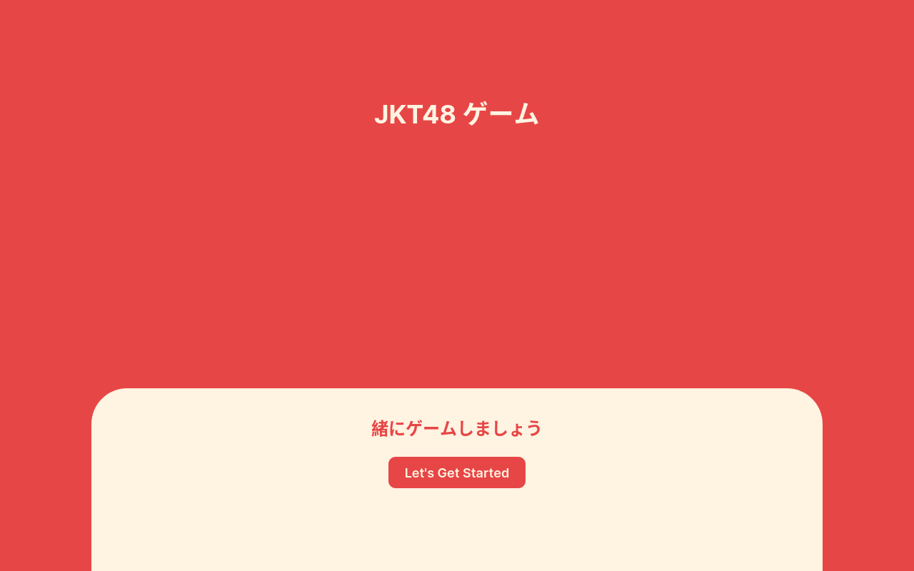
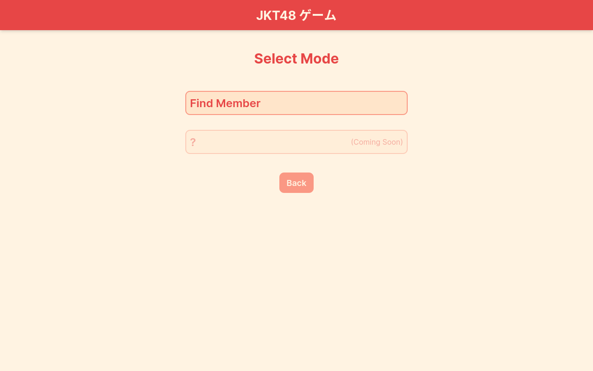
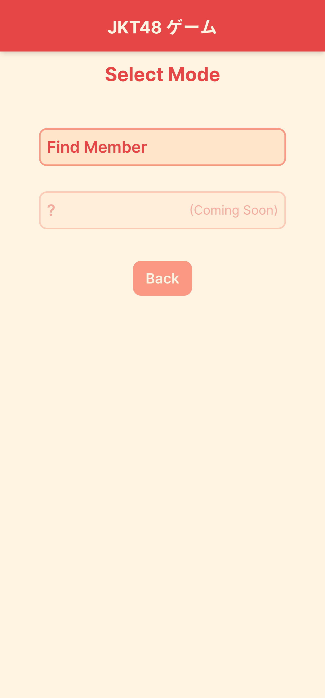
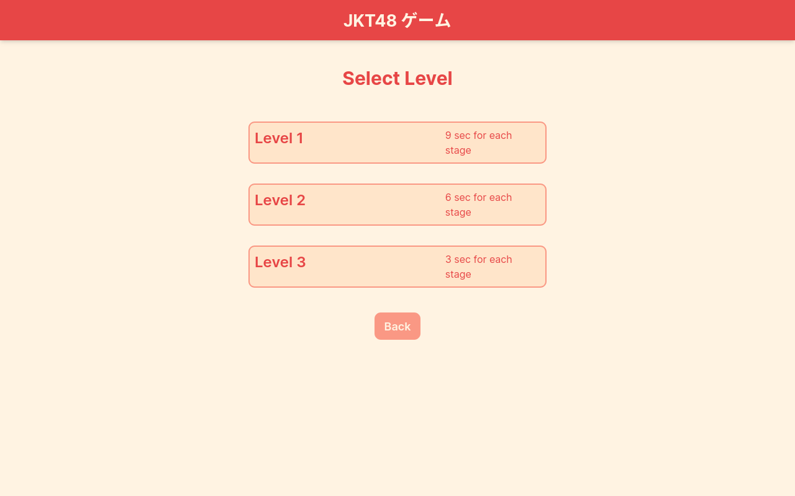
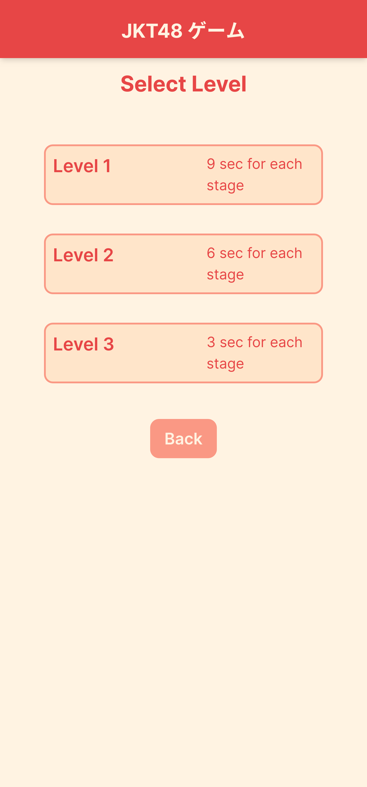
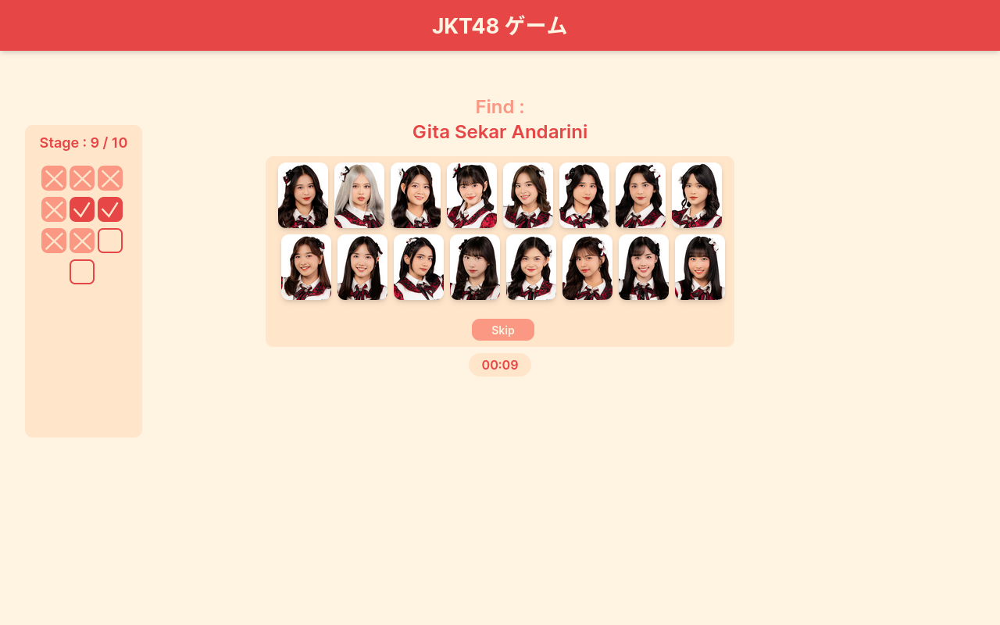
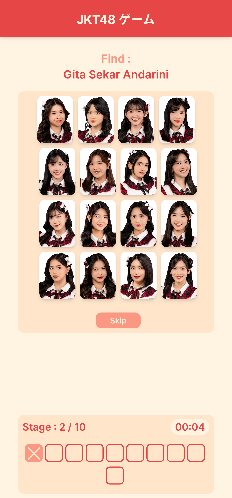

# jkt48-game

A simple fan-made JKT48 game on web platform.

<p>
  
  
</p>

<p>
   
   
</p>

## Game Mode

### 1. Find Member

A game where you have to find mentioned JKT48 member by clicking her picture inside the provided area with limited time. There are 3 levels available that has different time for each stage.

<p>
  
   
</p>

<p>
  
   
</p>

### 2. (?) Coming Soon

## Tech Stack

- [Vue](https://vuejs.org/) (requires node.js v18 or higher)
- [Tailwind CSS](https://tailwindcss.com/)

## Run Locally

### Provide required image assets

This project requires all JKT48 member's image. I don't want to provide it here so you need to look for it manually at [JKT48 website](https://jkt48.com) and place it inside the directory below:

```sh
public/img/member/
```

Name the file with format `[number].jpg`, for example : `1.jpg`, `2.jpg`, ... and so on as much as total amount of jkt48 member in file `./data/member.json`

### Install dependencies

```sh
yarn
```

### Compile and Hot-Reload for Development

```sh
yarn dev
```

### Type-Check, Compile and Minify for Production

```sh
yarn build
```

### Run Unit Tests with [Vitest](https://vitest.dev/)

```sh
yarn test:unit
```

### Lint with [ESLint](https://eslint.org/)

```sh
yarn lint
```

## Credits

- All JKT48 member's image assets belongs to [JKT48](https://jkt48.com)
